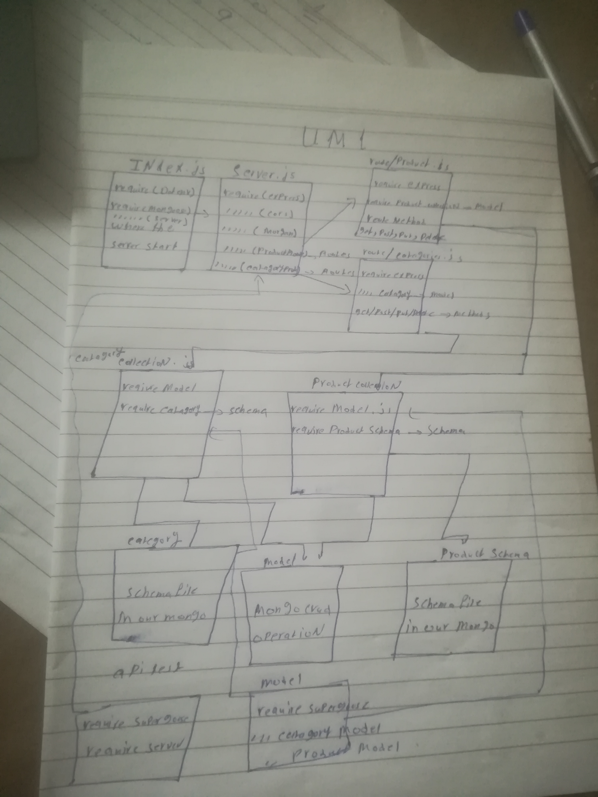

# LAB - Class 8

## Project: lab-08

### Author: Alaa almasri

### Links and Resources

- [submission PR](https://github.com/alaaalmasri12/api-server/pull/2)
- [ci/cd](https://github.com/alaaalmasri12/notes-v-2.0/actions/runs/117805220) (GitHub Actions)
-[swager](https://app.swaggerhub.com/apis/alaaalmasri12/lab-06-api/0.1)
### Documentaion

## CREATE a new record in a database, using the POST method on a custom API write the fellowing command
>http POST :3000/categories `<key>`=`<value>`

## GET list of all records in a database, using the GET method on a custom API write the fellowing command

>http GET :3000/categories

## As a developer, I want to GET an existing in a database, using the GET method with an ID parameter on a custom API write the fellowing command

>http GET :3000/categories/`<id>` or
>http GET :3000/categories?_id=`<id>`
## As a developer, I want to UPDATE an existing record in a database, using the PUT and PATCH methods with an ID parameter on a custom API

>http PUT :3000/categories/1 `<key>`=`<value>`
>http PUT :3000/categories/1 `<key>`=`<value>`

## As a developer, I want to DELETE an existing record in a database, using the DELETE method with an ID parameter on a custom API fellowing command

>http DELETE :3000/products/`<id>`
-

### Setup

#### `.env` requirements (where applicable)

i.e.

- `PORT` - 4000
- `MONGODB_URI` - MONGODB_URI = 'mongodb://localhost:27017/lab-08-db';

#### How to initialize/run your application (where applicable)

- e.g. `nodemon`

#### How to use your library (where applicable)

#### Tests

- How do you run tests?
 npm run test 
- Any tests of note?
models.test.js 6 tests
api-test.js  8 tests
- Describe any tests that you did not complete, skipped, etc
update test

#### UML

