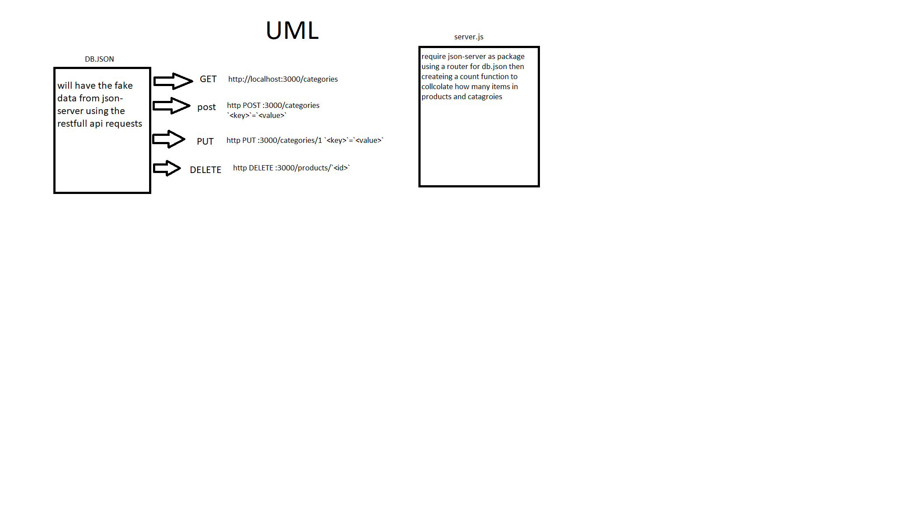

# LAB - Class 6

## Project: lab-06

### Author: Alaa almasri

### Links and Resources

- [submission PR](https://github.com/alaaalmasri12/api-server/pull/1)

-[swager](https://app.swaggerhub.com/apis/alaaalmasri12/lab-06-api/0.1)
### Documentaion

## CREATE a new record in a database, using the POST method on a custom API write the fellowing command
>http POST :3000/categories `<key>`=`<value>`

## GET list of all records in a database, using the GET method on a custom API write the fellowing command

>http GET :3000/categories

## As a developer, I want to GET an existing in a database, using the GET method with an ID parameter on a custom API write the fellowing command

>http GET :3000/categories/`<id>` or
>http GET :3000/categories?_id=`<id>`
## As a developer, I want to UPDATE an existing record in a database, using the PUT and PATCH methods with an ID parameter on a custom API

>http PUT :3000/categories/1 `<key>`=`<value>`
>http PUT :3000/categories/1 `<key>`=`<value>`

## As a developer, I want to DELETE an existing record in a database, using the DELETE method with an ID parameter on a custom API fellowing command

>http DELETE :3000/products/`<id>`
-

### Setup

#### `.env` requirements (where applicable)

i.e.

- `PORT` - Port Number
- `MONGODB_URI` - URL to the running mongo instance/db

#### How to initialize/run your application (where applicable)

- e.g. `node index.js`

#### How to use your library (where applicable)

#### Tests

- How do you run tests?
- Any tests of note?
- Describe any tests that you did not complete, skipped, etc

#### UML

